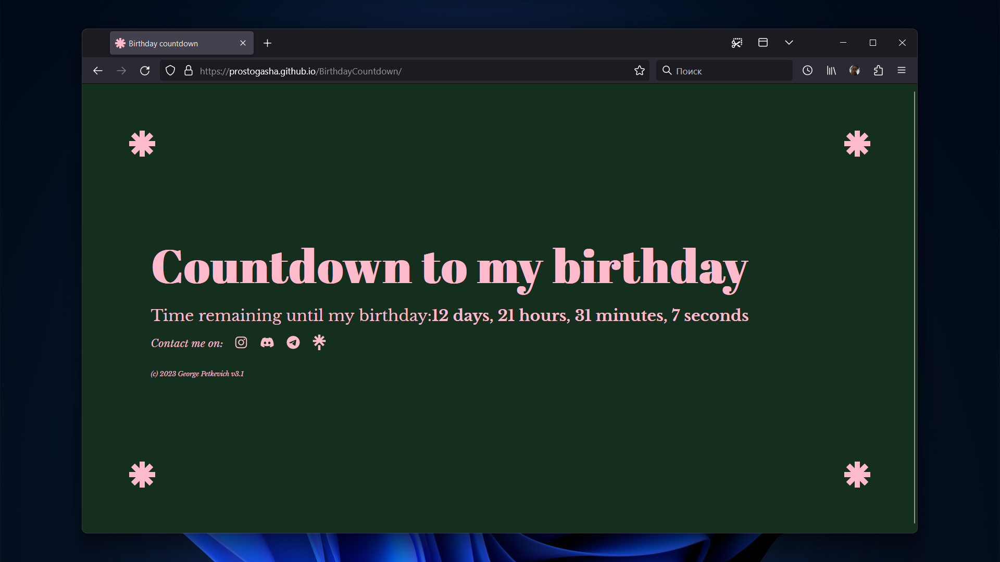

# BirthdayCountdown

**BirthdayCountdown** is a simple and intuitive web application that allows you to count down the days, hours, minutes, and seconds until your next birthday. It provides a real-time countdown timer, ensuring that you never miss out on the excitement and anticipation leading up to your special day.

## Demo

You can experience a live demo of the BirthdayCountdown application by visiting the [demo page](https://prostogasha.github.io/BirthdayCountdown).

## Usage

To start using BirthdayCountdown, follow these easy steps:

1. Clone or download this repository to your local machine.
2. Open the `index.html` file in your preferred web browser.
3. Modify the `birthday` variable in the JavaScript code to set your birthday. Ensure the date format follows `Month Day, Year Hour:Minute:Second`.
4. The countdown timer will automatically begin, providing you with a clear visualization of the remaining time until your birthday.

Feel free to customize the application's appearance or extend its functionality according to your preferences and requirements.

## Technologies Used

The BirthdayCountdown application is built using the following technologies:

- HTML
- CSS
- JavaScript

## License

This project is licensed under the [MIT License](LICENSE.md).

## Contributing

Contributions are highly appreciated! If you have any ideas, suggestions, or improvements, please feel free to contribute by opening an issue or submitting a pull request on the [GitHub repository](https://github.com/prostogasha/BirthdayCountdown).

## Author

BirthdayCountdown is created and maintained by [gasha337](https://linktr.ee/gasha337).

If you have any questions or feedback, please don't hesitate to contact me. Your input is invaluable in making this project even better.

---

**Note**: This README was last updated in `26.06.2023`. Please refer to the [GitHub repository](https://github.com/prostogasha/BirthdayCountdown) for the latest information and updates.
