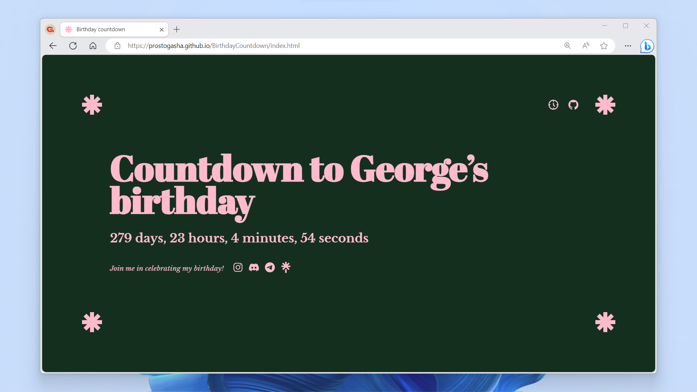

# BirthdayCountdown

[](https://gsh337.github.io/BirthdayCountdown)

> 🌳 BirthdayCountdown is a simple and intuitive web application that allows you to count down the days, hours, minutes and seconds until your next birthday. It provides a real-time countdown timer so you never miss the excitement and anticipation of your special day. Join the birthday party and customize the application to suit your preferences and needs.

## Features

- Displays a countdown timer to the next birthday
- Updates the countdown in real-time
- Shows the remaining days, hours, minutes, and seconds
- Changes singular/plural words based on the countdown values
- Provides social media icons to join the birthday celebration
- Includes a large clock mode with a larger countdown timer
- Supports toggling fullscreen mode
- Includes confetti animation when the countdown reaches the target date

## Demo

You can experience a live demo of the BirthdayCountdown application by visiting the [demo page](https://gsh337.github.io/BirthdayCountdown).

## Getting Started

To get a local copy of the project up and running on your machine, follow these steps:

1. Clone the repository:

```bash
git clone https://github.com/prostogasha/BirthdayCountdown.git
```

2. Open the `index.html` file in your preferred web browser.

3. Modify the `birthday` variable in the `script.js` file to set your birthday. Ensure the date format follows `Month Day, Year Hour:Minute:Second`.

4. The countdown timer will automatically begin, providing you with a clear visualization of the remaining time until your birthday.

## Technologies Used

The BirthdayCountdown application is built using the following technologies:

- HTML
- CSS
- JavaScript

## Dependencies

The project uses the following dependency:

- [TypeScript Particles](https://github.com/matteobruni/tsparticles)

## Contributing

Contributions are highly appreciated! If you have any ideas, suggestions, or improvements, please feel free to contribute by opening an issue or submitting a pull request on the [GitHub repository](https://github.com/gsh337/BirthdayCountdown).

## License

This project is licensed under the [MIT License](LICENSE.md).

---

Enjoy counting down to your special day! 🎉
